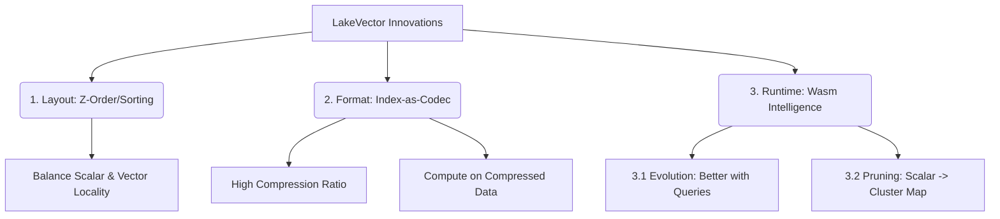

# LakeVector 核心创新点总结 (Summary of Innovations)

您的总结非常精准，这三点构成了 LakeVector 的 "Three Pillars" (三大支柱)。我们将它们映射为学术/工程术语，逻辑如下：

## 1. 物理布局优化 (Layout Optimization)
> User: "通过 z-order 优化行的排列顺序， 在标量查询和向量查询的需求之间 trade-off"

*   **核心概念**: **Multi-dimensional Clustering (MDC)**
*   **技术实现**:
    *   **Baseline**: 简单的 `Sort(ClusterID, Timestamp)`。缺陷是 `ClusterID` 本身没有空间局部性（Cluster 1 和 Cluster 100 可能在空间上相邻，但文件里离很远）。
    *   **Advanced (User Insight)**: **Hierarchical Z-Order**.
        1.  **Centroid Linearization**: 将高维的聚类中心 (IVF Centroids) 通过降维或 Hilbert Curve 映射为一维的 `SpatialKey`。确保空间上相邻的 Cluster，其 Key 也相近。
        2.  **Global Ordering**: 对 `(SpatialKey, Timestamp)` 进行 Z-Order 排序。
    *   **收益**: 当查询需要 Probe 多个相邻 Cluster 时（`nprobe > 1`），不仅 Cluster 内部是连续的，**Cluster 之间也是尽可能连续的**，最大化合并 S3 Range Request。

    ### 1.1 排序策略的 Trade-off (Sorting Strategy Analysis)
    *   **核心权衡 (Core Trade-off)**: 在 S3 上，**"读多少数据" (Volume)** 和 **"发多少请求" (Request Count)** 是两个不同的成本维度。
        *   虽然标量过滤后命中的数据总量一样，但**物理分布决定了请求数量**。
    
    | 排序策略 (Sort Key) | 优势 | 劣势 (在 S3 上的痛点) |
    | :--- | :--- | :--- |
    | **Vector-Major** (`Sort(ClusterID)`) | **纯向量查极快**。相似向量聚在一起，1次 GET 搞定。 | **时间范围查代价高 (High Request Count)**。 虽然只读命中的 Cluster，但这些 Cluster **散落**在文件各处。 例如命中了 100 个 Cluster，需要发 **100 次 GET 请求** (或复杂的 Range Merging)。 **S3 延迟 = 100 * 50ms = 5s (不可接受)**。 |
    | **Scalar-Major** (`Sort(Timestamp)`) | **时间过滤极快**。"昨天"的数据是连续一大块，**1次 GET 搞定**。 | **向量查代价高**。相似向量散落在不同时间段，同样面临严重的 **I/O 碎片化** 问题。 |
    | **Z-Order** (`Morton(Cluster, Time)`) | **均衡 (Balanced)**。 | **I/O 合并率高**。Z-order 保证了在任何维度查询时，数据相对集中。 上述 100 个 Cluster 可能集中在 3-4 个较大的连续区域，**只需 3-4 次请求**。 |

## 2. 索引即压缩 (Index-as-Codec Synergy)
> User: "利用索引结构达到更好的压缩比"

*   **核心概念**: **Coupled Compression & Indexing**
*   **技术实现**:
    *   **原理**: 向量索引（如 IVF 的 Centroids，PQ 的 Codebooks）本质上就是一种有损压缩的字典。
    *   **LakeVector 做法**: 不再存储原始向量+额外索引，而是**只存储压缩后的 Latent Codes (PQ Codes)**。
    *   **收益**: 
        *   存储成本降低 5x-10x。
        *   I/O 传输量减少。
        *   距离计算直接在 Latent Code 上进行 (Look-up Table)，无需解压。

## 3. 智能查询与演进 (Intelligent Query & Evolution)
> User: "优化 filter anns 这个问题在文件格式的表现"

这一部分最能体现 "S3 + Wasm" 的独特价值，分为两个子方向：

### 3.1 演进式查询 (Evolutionary Query Processing)
> User: "实现‘越查越好’的文件"

*   **核心概念**: **Log-Structured Feedback Loop**
*   **技术实现**:
    *   **Micro-Logging**: 每次查询追加少量统计日志 (Selectivity, Latency)。
    *   **Self-Optimization**: 后台计算任务定期消费日志，更新 Wasm 内部的 Cost Model 参数，追加回文件 Footer。
    *   **效果**: 对于同一份静态数据，随着访问次数增加，文件关联的“智能参数”越来越精准，查询越来越快。

### 3.2 标量感知剪枝 (Scalar-Aware Pruning)
> User: "实现 ‘标签、标量范围→聚类集合’ 的聚类"

*   **核心概念**: **Coarse-Grained Correlation (Bitmap Indexing)**
*   **技术实现**:
    *   **Grid Bitmap**: 在 Footer 建立 `TimeBin -> ClusterID Bitmap` 的映射。
    *   **Pushdown**: 用户查询 `Time > T1`，Wasm 直接查 Bitmap 算出：“只要下载 Cluster 3, 5, 9，其他 Cluster 即使有数据也不满足时间条件”。
    *   **收益**: 实现 **Zero-I/O Pruning**，在发出 GetObject 请求前就以此过滤掉 90% 的 I/O。

---

## 总结构架图

